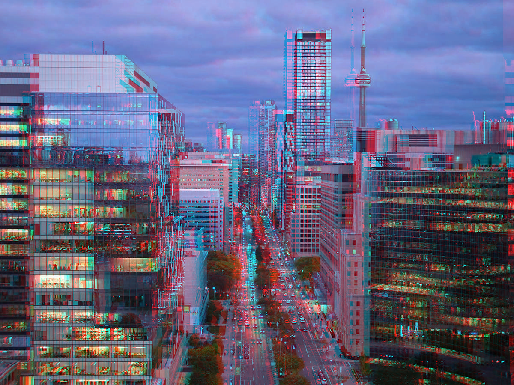
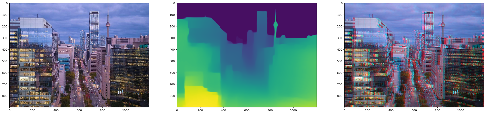

# 2D to 3D Image
This demo uses the [MiDaS](https://github.com/isl-org/MiDaS) depth estimation technology to predict depth from 2D images. The depth map is then used to generate an anaglyph 3D image by offsetting the RGB channels, simulating a stereoscopic effect. This demo works both for images and videos, you can try it with the link below.

Link: https://colab.research.google.com/drive/1xbs3EAFLESumLoe3LBxnZZVPjCmA_krT?usp=sharing

## Demonstration

### Drone shot of Toronto

  
  

- **Converted Anaglyph 3D Image**: The above shows a [drone shot of Toronto](https://www.robertlowdon.com/drone-photography-toronto-a-comprehensive-guide/) which has been converted into an anaglyph 3D image using **MiDaS** depth estimation technology (*DPT_Large*) model. The notebook offers three models:

| Model Name        | Description                                               | Accuracy        | Inference Speed    |
|-------------------|-----------------------------------------------------------|-----------------|--------------------|
| **DPT_Large**      | MiDaS v3 - Large                                          | Highest accuracy| Slowest inference  |
| **DPT_Hybrid**     | MiDaS v3 - Hybrid                                         | Medium accuracy | Medium inference   |
| **MiDaS_small**    | MiDaS v2.1 - Small                                        | Lowest accuracy | Fastest inference  |

---

### MiDaS depth estimation

  

## Prerequisites
- Python >= 3.7
- Libraries: `torch`, `opencv-python`, `numpy`, `matplotlib`, `MiDaS`, and `tqdm`
- A GPU is recommended for faster processing, but the demo will work on CPU as well.

## Troubleshooting
- **Issue**: "CUDA out of memory" error.
  **Solution**: Reduce the image resolution or switch to CPU mode.
- **Issue**: Depth map not generating correctly.
  **Solution**: Ensure the input image is in a standard format like JPEG or PNG.

## Credits
- Depth estimation models: [MiDaS by Intel ISL](https://github.com/isl-org/MiDaS)
- Original image source: [Robert Lowdon](https://www.robertlowdon.com/drone-photography-toronto-a-comprehensive-guide/)

